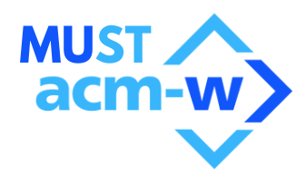

## Overview

- The goal of this project is to have codes for various data structures and algorithms - in C, C++, Java, Python, C#, Go, JavaScript, PHP, Kotlin and Scala. 
- Feel free to contribute in any way you want.
- Make sure to follow the contribution guidelines listed below.

## Content

- We currently have 10 folders for 10 programming languages - C, C++, Java, Python, C#, Go, JavaScript, PHP, Kotlin and Scala.
- **Do not create folders in your submissions, unless specifically told to do so.**

 

**YOU CANNOT CREATE A PR DIRECTLY. YOU NEED TO BE ASSIGNED AN ISSUE. IF THE ISSUE DOES NOT EXIST, CREATE ONE, ASK FOR IT IN YOUR PREFERRED PROGRAMMING LANGUAGE AND WAIT FOR IT TO BE ASSIGNED TO YOU. NOT FOLLOWING THIS WILL BE CONSIDERED A VIOLATION AND YOUR PR WILL BE MARKED INVALID. WHILE CREATING AN ISSUE, PLEASE FOLLOW THE FORMAT, ELSE, THE ISSUE WILL BE CLOSED.**

 

## Contribution Guidelines {For a more detailed explanation read [How to Contribute?](/CONTRIBUTING.md)}

- Issues will be assigned on a **_first come, first serve_ basis**. The person who creates the issue gets the first priority. And then, issues are assigned based on who commented first. You just have to comment on the issue, asking to be assigned and the **programming language** you should be assigned in, and it will be done if found fit.
- You cannot work on any issue that is not assigned to you.
- If you have anything else in mind, FEEL FREE TO CREATE AN ISSUE and please wait for it to be assigned to you. If assigned to you, then you can start working on it and create a PR.
- **All PRs must be made from a Branch. Create a separate branch for every Issue you are working upon and then create a PR.**
- **In your code file, add (Inside a multiline comment) Sample Input and Output at the end of the file along with Time and Space Complexity.**
- Every time you add a file via a Pull Request also update the README.md file for that particular language in **Alphabetical Order** in the same PR. You'll find a README.md file in each language folder.
- **Plagiarism is highly discouraged and a plagiarized PR won't be accepted at all and will be marked as spam.**
- **PR should be created within a week of you being assigned to it.**
- **At no point of time, you can claim more than 4 issues i.e. you can have at max 4 working issues, for this repository, at any point of time.**

 

### Where to upload the files

**PLEASE READ THIS**

- Your files should be uploaded directly into the corresponding folder (e.g. if you wrote code for a Data Structure in C-Plus-Plus, it goes inside the C-Plus-Plus folder and so on)
- Edit the corresponding _README.md_ file to **add the link to your code in the corresponding section** ([GitHub Markdown Guide](https://guides.github.com/features/mastering-markdown/))
- **Under no circumstances create new folders within the language folders to upload your code unless specifically told to do so**.

 

## Don't know how to create a PR? Refer this: [Steps to create a PR](STEPS_FOR_PR.md)

## Maintainers for this project (Refer [this](MAINTAINERS.md) for Instructions specific to Maintainers)
- Sukriti Shah - @sukritishah15

### Past Maintainers for this project
- Sukriti Shah - @sukritishah15
- Aditi Khemka - @aditik03
- Gunisha Chaturvedi - @gunisha30
- Manan - @manan025
- Sumit Kumar Roy - @mephi007
- Falguni Sarkar - @lostgirljourney
- Ananya Nagar - @AnanyaNagar
- Rahul Joshi - @mrjoshi0147
- Unnati Deshwal - @unnatideshwal
- Manan Chawla - @mananchawla2005
- Niranjan Kumar S - @niranjantuty
- Sunil Nair- @sunilgknair051
- Muskan Gupta - @muskangupta19
- Priyal - @priyal2806
- Mahima Goyal - @mahimagoyalx
- Paul Evans - @PaulEvans8669
- Aman Parauliya - @parauliya
- Arnav Roy - @arnav-roy
- Wallace Costa - @wallacecosta
- Shivam Yadav - @ExpressHermes

 

  <h1>In association with</h1>
  <h3>ACM-W MUST STUDENT CHAPTER (Sept - Oct 2020)</h3>
  

## License

This project follows the [MIT License](/LICENSE).

## SHOW SOME LOVE BY LEAVING A ⭐
